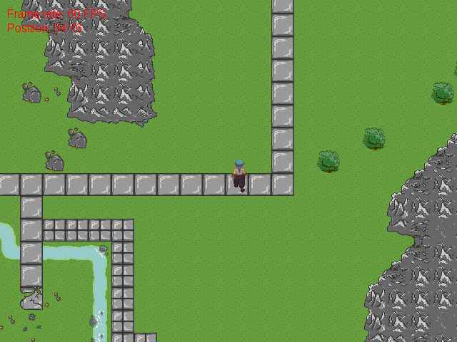



## DirectX Tile Engine

### Description

This is a little tile engine I made a few months back. It includes a map editor, the engine itself and a built in little example. The engine supports things like fadein/fadeout, collision detection, scrolling maps of unlimited size, ''Tile portals'' (Tiles which when stepped on lead to other tiles/maps. For example - try going inside the caves for a pleasant surprise). Be sure to read the readme file and if you plan on using the editor, read the help file. Comments/Suggestions welcome.
 
### More Info
 

             |
---                |---
**Submitted On**   |2003-08-19 20:30:50
**By**             |[IRBMe](https://github.com/Planet-Source-Code/PSCIndex/blob/master/ByAuthor/irbme.md)
**Level**          |Intermediate
**User Rating**    |4.3 (26 globes from 6 users)
**Compatibility**  |VB 6\.0
**Category**       |[DirectX](https://github.com/Planet-Source-Code/PSCIndex/blob/master/ByCategory/directx__1-44.md)
**World**          |[Visual Basic](https://github.com/Planet-Source-Code/PSCIndex/blob/master/ByWorld/visual-basic.md)
**Archive File**   |[DirectX\_Ti164028932003\.zip](https://github.com/Planet-Source-Code/irbme-directx-tile-engine__1-48213/archive/master.zip)

